## Authentication met firebase

### Stap 1: input velden
We hebben een email en een password veld nodig in App.js.

    import React from 'react'
    import './App.css'
    
    function App() {
    
        return (
            <main>
                

                    <h1>Register</h1>
                    <input type='email' placeholder="email"/>
                    <input type='password' placeholder="password"/>
                

            </main>
        );
    }
    
    export default App

Om de velden in het midden van het scherm te krijgen gebruiken we de volgende .css.

    main {
        min-height: 100vh;
        width: 100vw;
        display: flex;
        flex-direction: column;
        align-items: center;
        justify-content: center;
    }

Met de volgende .css code komen de inputs onder elkaar.

    #loginform {
        display: flex;
        flex-direction: column;
        align-items: center;
    }

Met .css ervoor zorgen dat het eruit ziet als een formulier.

    #loginform {
        display: flex;
        flex-direction: column;
        align-items: center;
        border: 1px solid grey;
        padding: 5rem;
    }

We geven de input velden in .css een margin zodat ze niet tegen elkaar staan.

    #loginform input {
        margin: 1px;
    }

### Stap 2: button

    import React from 'react'
    import './App.css'
    
    function App() {
    
        return (
            <main>
                

                    <h1>Register</h1>
                    <input type='email' placeholder="email"/>
                    <input type='password' placeholder="password"/>
                    <input type='submit' value='register'/>
                

            </main>
        );
    }
    
    export default App

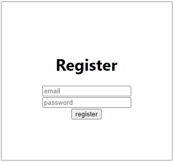

### Stap 3: Firebase project aanmaken

We focussen ons op het stukje <b>build</b> van firebase. Ga naar https://firebase.google.com/

Klik op <i>get started</i>. De firebase wordt aan jouw google account gelinkt.
1. Maak een nieuw project aan
2. Geef het project een naam
3. Google Analytics is enable
4. Klik op create project

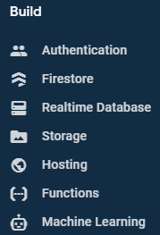

### Stap 4: Firebase app toevoegen

Firebase wilt graag weten vanuit waar je gaat communiceren met de back-end firebase. Met React zijn we bezig met een web app dus kiezen we voor `</>` web.

We gaan de app registreren en klikken op register app.

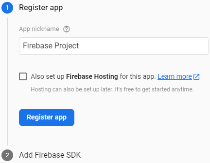

Vervolgens krijg je een veld met code. Deze code gaan wij (nog) niet gebruiken in React. Click op <i>continue</i> to console.

De manier hoe we Firebase aan React toevoegen is via npm.

    npm install --save firebase

We zetten de code bovenin App.js.

    import firebase from 'firebase';
    
    const app = firebase.initializeApp({ ... });

Tussen de { ... }  moet een object komen te staan: de firebase code. Wanneer je teruggaat naar de firebase website, klik je op het wieltje naast <i>project overview</i> en kiest voor <i>project settings</i>. De code die je gaat gebruiken heet `Your web app's Firebase configuration`.

Let op dat je je apiKey in een environment variabel zet, zodra je de code online zet.

    const app = firebase.initializeApp({
        apiKey: "",
            authDomain: "novi-demo076.firebaseapp.com",
            projectId: "novi-demo076",
            storageBucket: "novi-demo076.appspot.com",
            messagingSenderId: "991754906838",
            appId: "1:991754906838:web:02f46907f025e91169ed77"
    });

### Stap 5: firebase in modules zetten

Firebase vindt het niet fijn om zichzelf elke keer te herladen en dit gebeurt in React zodra je op save drukt. Je krijgt dan een foutmelding in je webbrowser: `Firebase: Firebase App named '[DEFAULT]' already exists (app/dupplicate-app)`.

We gaan code in een module zetten: maak een nieuwe map genaamd `modules` met daarin een bestand genaamd `firebase.js`

    import firebase from 'firebase';
    
    const app = firebase.initializeApp({
        apiKey: "",
        authDomain: "novi-demo076.firebaseapp.com",
        projectId: "novi-demo076",
        storageBucket: "novi-demo076.appspot.com",
        messagingSenderId: "991754906838",
        appId: "1:991754906838:web:02f46907f025e91169ed77"
    });
    
    export default app;

In App.js import je dit bestand.

    import app from './modules/firebase'

### Stap 6: onSubmit functie in App.js

    const onSubmit = event => {
        console.log(event);
    }

We passen `
` aan naar een `form` en zetten de onSubmit functie erin.

    return (
        <main>
            <form onSubmit={onSubmit} id='loginform'>
                <h1>Register</h1>
                <input type='email' placeholder="email"/>
                <input type='password' placeholder="password"/>
                <input type='submit' value='register'/>
            </form>
        </main>
    );

### Stap 7: event target

Wanneer je een email adres en wachtwoord invult krijg je in je console het volgende te zien.

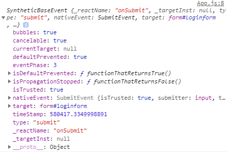

Target is hierbij het belangrijkst. De target is een array.

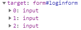

Dus uit het event target halen we `[ email, password ]` (via destructure).

    const onSubmit = event => {
        event.preventDefault();
        const [ email, password ] = event.target;
        console.log(email, password);
    }

Deze twee elementen komen uit de console.

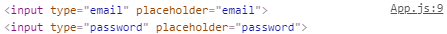

We zijn op zoek naar hun values.

    const onSubmit = event => {
        event.preventDefault();
        const [ email, password ] = event.target;
        console.log(email.value, password.value);
    }

### Stap 8: opslaan in firebase

We willen een gebruiker registreren. De volgende documentatie helpt daarbij:
https://firebase.google.com/docs/auth/web/start.

Maak een formulier waarmee nieuwe gebruikers zich met hun e-mailadres en wachtwoord kunnen registreren bij de app. Wanneer een gebruiker het formulier invult, valideer je het e-mailadres en wachtwoord van de gebruiker en geef je ze door aan de methode `createUserWithEmailAndPassword`.

Dit is hoe een gebruiker wordt ingelogd in firebase: `firebase.auth().createUserWithEmailAndPassword(email, password)`.

    const onSubmit = event => {
        event.preventDefault();
        const [ email, password ] = event.target;
        app.auth().createUserWithEmailAndPassword(email.value, password.value)
        console.log(email.value, password.value);
    }

### Stap 9: asynchroon code runnen: async en await

    const onSubmit = async event => {
        event.preventDefault();
        const [ email, password ] = event.target;
        const user = await app.auth().createUserWithEmailAndPassword(email.value, password.value);
        console.log(user);
    }

Wanneer je nu wilt registreren krijg je de volgende foutmelding.

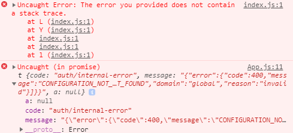

Wat je nog moet doen is tegen firebase zeggen welk deel van de backend hij moet aanzetten.

Je gaat naar je project in https://firebase.google.com, klikt in <i>build</i> voor <i>authentication</i> en kiest voor <i>get started</i>.

De sign-in providers die je enable zijn <i>email/password</i>.

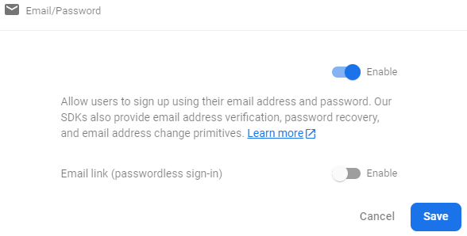

Je krijgt van register in console een user object terug. Dit betekent dat we een user hebben geregistreerd. Echter gebeurd er nog niks in onze interface.

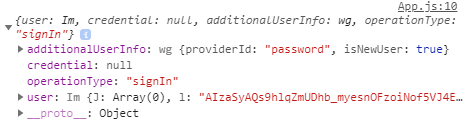

#### Registratie compleet

    import React from 'react'
    import './App.css'
    import app from './modules/firebase'
    
    function App() {
        const onSubmit = async event => {
            event.preventDefault();
            const [email, password] = event.target;
            const user = await app.auth().createUserWithEmailAndPassword(email.value, password.value);
            console.log(user);
        }
    
        return (
            <main>
                <form onSubmit={onSubmit} id='loginform'>
                    <h1>Register</h1>
                    <input type='email' placeholder="email"/>
                    <input type='password' placeholder="password"/>
                    <input type='submit' value='register'/>
                </form>
            </main>
        );
    }
    
    export default App

### Stap 10: login: state userIntent

Maak een formulier waarmee bestaande gebruikers zich kunnen aanmelden met hun e-mailadres en wachtwoord. Wanneer een gebruiker het formulier invult, roep je de methode `signInWithEmailAndPassword` op.

We willen kunnen wisselen tussen inloggen en registreren, dit doen we met `state`.

Importeer `useState`.

    import React, {useState} from 'react'

We maken een register `state` en vervangen het woordje register voor `userIntent`.

    import React, {useState} from 'react'
    import './App.css'
    import app from './modules/firebase'
    
    function App() {
    const [userIntent, setUserIntent] = useState('Register')
    
        const onSubmit = async event => {
            event.preventDefault();
            const [email, password] = event.target;
            const user = await app.auth().createUserWithEmailAndPassword(email.value, password.value);
            console.log(user);
        }
    
        return (
            <main>
                <form onSubmit={onSubmit} id='loginform'>
                    <h1>{userIntent}</h1>
                    <input type='email' placeholder="email"/>
                    <input type='password' placeholder="password"/>
                    <input type='submit' value={userIntent}/>
                    <button onClick={() => setUserIntent(userIntent == 'Register' ? 'Login' : 'Register')}>Switch</button>
                </form>
            </main>
        );
    }
    
    export default App

Om de button register te vervangen naar login wanneer je op register klik doe je met de volgende code.

    <button onClick={ f => setUserIntent( userIntent == 'Register' ? 'Login' : 'Register' ) }>
    { userIntent == 'Register' ? 'Login' : 'Register' } instead
    </button>

### Stap 11: login of register met if-statement 

We switchen van register naar login.

    const onSubmit = async event => {
        event.preventDefault();
        const [email, password] = event.target;

        if( userIntent == 'Register' ) {
            const user = await app.auth().createUserWithEmailAndPassword( email.value, password.value )
        } else {
            const user = await app.auth().signInWithEmailAndPassword( email.value, password.value )
        }
    }

### Stap 12: user opslaan in state

    const [ appUser, setAppUser ] = useState( undefined )

Wat er terugkomt wanneer je registreert is niet een `user` maar een `userCredential.user`. Dus eigenlijk wat we willen is `user` extracten uit de response en dan `setUser` naar de nieuw verkregen `user` zetten.

    const [appUser, setAppUser] = useState(undefined)

    const onSubmit = async event => {
        event.preventDefault();
        const [email, password] = event.target;

        if (userIntent == 'Register') {
            const {user} = await app.auth().createUserWithEmailAndPassword(email.value, password.value)
            setAppUser(user)
        } else {
            const {user} = await app.auth().signInWithEmailAndPassword(email.value, password.value)
            setAppUser(user)
        }
        console.log(appUser)
    }

Let op: logica wanneer er iets misgaat mist nog!

Je krijgt nu in de console: undefined. We gaan dieper in de code kijken met behulp van console.log.

    if (userIntent == 'Register') {
        const response = await app.auth().createUserWithEmailAndPassword(email.value, password.value)
        console.log('Auth. response:', response)
        // setAppUser(user)
    } else {
        const response = await app.auth().signInWithEmailAndPassword(email.value, password.value)
        console.log('Auth. response:', response)
        // setAppUser(user)
    }

Wanneer je nu inlogt krijg je het volgende in de console. Er zit data in onze user.

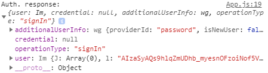

User heeft een email property in de console staan. We kunnen het volgende checken op het formulier: als de user bestaat (`appUser`) dan willen we een `<h2>` met de `appUser.email`.

    import React, {useState} from 'react'
    import './App.css'
    import app from './modules/firebase'
    
    function App() {
    const [userIntent, setUserIntent] = useState('Register')
    const [appUser, setAppUser] = useState(undefined)
    
        const onSubmit = async event => {
            event.preventDefault();
            const [email, password] = event.target;
    
            if (userIntent == 'Register') {
                const response = await app.auth().createUserWithEmailAndPassword(email.value, password.value)
                console.log('Auth. response:', response)
                setAppUser(response.user)
            } else {
                const response = await app.auth().signInWithEmailAndPassword(email.value, password.value)
                console.log('Auth. response:', response)
                setAppUser(response.user)
            }
            console.log(appUser)
        }
    
        return (
            <main>
                <form onSubmit={onSubmit} id='loginform'>
                    <h1>{userIntent}</h1>
                    {appUser && <h2>{appUser.email}</h2>}
                    <input type='email' placeholder="email"/>
                    <input type='password' placeholder="password"/>
                    <input type='submit' value={userIntent}/>
                    <button onClick={f => setUserIntent(userIntent == 'Register' ? 'Login' : 'Register')}>
                        {userIntent == 'Register' ? 'Login' : 'Register'} instead
                    </button>
                </form>
            </main>
        );
    }
    
    export default App

Wanneer je nu inlogt krijg je in het beeldscherm het emailadres waarmee je wilt inloggen.

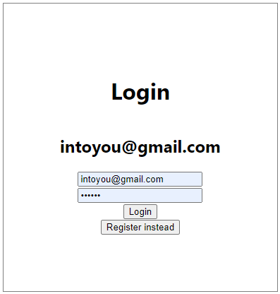

### Stap 13: formulier wel/niet laten zien

Op het moment dat de app user bestaat, dan willen we dit form niet laten zien.

Als er geen appUser bestaat, willen we het form laten zien met `{ !appUser &&`.

Als er wel een appUser is dan wordt het form onzichtbaar `{appUser && <h1>Welcome {appUser.email}</h1>}`

    import React, {useState} from 'react'
    import './App.css'
    import app from './modules/firebase'
    
    function App() {
    const [userIntent, setUserIntent] = useState('Register')
    const [appUser, setAppUser] = useState(undefined)
    
        const onSubmit = async event => {
            event.preventDefault();
            const [email, password] = event.target;
    
            if (userIntent == 'Register') {
                const response = await app.auth().createUserWithEmailAndPassword(email.value, password.value)
                console.log('Auth. response:', response)
                setAppUser(response.user)
            } else {
                const response = await app.auth().signInWithEmailAndPassword(email.value, password.value)
                console.log('Auth. response:', response)
                setAppUser(response.user)
            }
            console.log(appUser)
        }
    
        return (
            <main>
                {!appUser &&
                <form onSubmit={onSubmit} id='loginform'>
                    <h1>{userIntent}</h1>
                    <input type='email' placeholder="email"/>
                    <input type='password' placeholder="password"/>
                    <input type='submit' value={userIntent}/>
                    <button onClick={() => setUserIntent(userIntent == 'Register' ? 'Login' : 'Register')}>
                        {userIntent == 'Register' ? 'Login' : 'Register'} instead
                    </button>
                </form>
                }
                {appUser && <h1>Welcome {appUser.email}</h1>}
            </main>
        );
    }
    
    export default App

Wanneer je een email en wachtwoord registreer, dan komt je emailadres in beeld: je bent ingelogd.

Wat er allemaal in de achtergrond is gebeurd, het uitwisselen van tokens, het uitwisselen van cookies, ervoor zorgen dat het veilig gebeurd, dat de database het allemaal bijhoud, wordt allemaal door firebase gedaan en daar hoeven wij ons geen zorgen over te maken.
